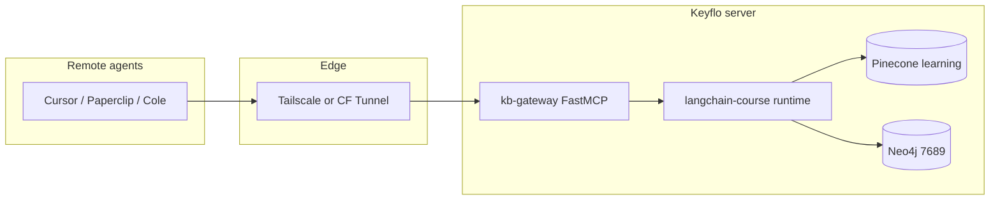

# Architecture — kb-gateway

## System context

## Components

| Component | Path | Role |
|---|---|---|
| MCP server | `kb_gateway/server.py` | FastMCP tools, streamable HTTP |
| Tool layer | `kb_gateway/tools.py` | Delegates to langchain-course |
| Graph layer | `kb_gateway/graph.py` | Read-only Cypher |
| Bootstrap | `kb_gateway/lc_bootstrap.py` | Path + env for LC repo |
| Router (upstream) | `langchain-course/runtime/agentic_router.py` | graph/vector/both |
| Vector RAG (upstream) | `langchain-course/runtime/query.py` | Namespace RAG |

## Data flow — route_query

1. Client calls MCP `route_query(question)`
2. Gateway → `agentic_router.route_query`
3. LLM classifies → retrieve from graph and/or vector → grade → answer
4. JSON returned to client

## Security boundaries

- L1: Bearer token on HTTP MCP
- L2: Namespace whitelist (no own-notes/orchestrations)
- L3: Neo4j read-only Cypher guard + no direct bolt exposure
- L4: Pinecone keys never leave server

## Deployment unit

Single Python process on server port 8790 (default), bound localhost, exposed via Tailscale/CF.
